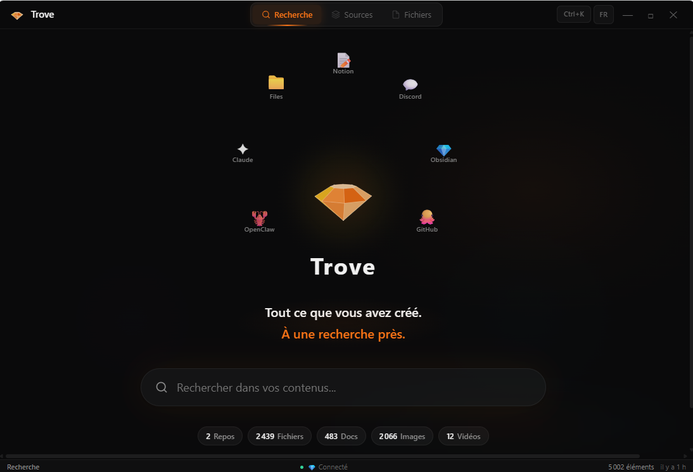

<p align="center">
  
</p>

<h1 align="center">Trove</h1>

<p align="center">
  <strong>Search everything you've ever made. Locally.</strong>
</p>

<p align="center">
  <a href="https://opensource.org/licenses/MIT"></a>
  <a href="https://nodejs.org"></a>
  <a href="https://github.com/antoinebecker10-afk/trove"></a>
</p>

---

## What is this?

I kept losing time looking for stuff across GitHub, Notion, local folders, Obsidian, Slack, Figma... everything scattered everywhere. So I built Trove to index all of it in one place and make it searchable.

```bash
npx trove-os setup
npx trove-os search "that API design doc from last week"
```

It runs on your machine. No cloud, no account, no subscriptions.

---

## Why it matters for AI agents

The part I didn't expect to be the most useful: Trove ships an **MCP server**. Instead of Claude Code (or any agent) scanning your filesystem file by file — burning thousands of tokens — it queries a pre-built index and gets what it needs in one call.

```bash
claude mcp add trove -- npx trove-os mcp
```

Then just ask normally: *"find my Figma mockups for the landing page"* — Claude hits the index instead of doing 15 `glob` + `grep` calls.

In practice, that's gone from ~10,000-50,000 tokens per file search down to 200-500. Your mileage will vary depending on project size.

---

## What it connects to

Trove has a plugin system — each source is a "connector" (a single TypeScript file, ~100-200 lines).

**Currently working:**

| | Source | What gets indexed |
|---|--------|------------------|
| 📁 | Local files | Code, docs, images, videos — anything on your machine |
| ⬡ | GitHub | Repos, READMEs, metadata |
| 📝 | Notion | Pages, databases, content as Markdown |
| 💎 | Obsidian | Vault notes, frontmatter, wiki-links, tags |
| 📊 | Google Drive | Docs, Sheets, Slides |
| 💬 | Slack | Messages, bookmarks, threads |
| 🎮 | Discord | Messages, pins |
| 🎨 | Figma | Files, components, pages |
| 📐 | Linear | Issues, docs, projects |
| 🤖 | OpenClaw | Conversations, memories, skills |
| 🧠 | Claude Code | Conversations, project memories |
| 📘 | Confluence, Airtable, Dropbox, Raindrop | Various |

All connectors use raw `fetch` — zero SDK dependencies. Pagination, rate limiting, and abort signals built in.

**Want to add one?** See [writing a connector](#write-a-connector) — it's genuinely not much code.

---

## Getting started

```bash
# Setup wizard — walks you through connecting sources + installing local AI
npx trove-os setup
```

The wizard handles everything: source selection, API tokens, Ollama model install, first index.

If you prefer doing it by hand:

```bash
npx trove-os init            # Creates .trove.yml + .env
# Edit them, then:
npx trove-os index
npx trove-os search "query"
```

### Use with MCP agents

Works with Claude Code, OpenClaw, Cursor, Windsurf, Cline — anything that speaks MCP.

```bash
# Claude Code
claude mcp add trove -- npx trove-os mcp

# OpenClaw
openclaw config set mcpServers.trove.command "npx"
openclaw config set mcpServers.trove.args '["trove-os", "mcp"]'

# Any MCP agent
npx trove-os mcp   # stdio server
```

---

## Desktop app

```bash
trove-os desktop
```

<p align="center">
  
</p>

Electron app with search, source management, file browser (dual-pane, drag & drop), keyboard shortcuts. Connects to the same index as the CLI and MCP server.

---

## How search works

1. **Embeddings** — Trove computes vector embeddings for all your content. Supports Ollama (recommended, free), Transformers.js (local), TF-IDF (zero-dep fallback), or Anthropic (cloud).
2. **Semantic search** — Queries are matched by meaning, not just keywords. "login page design" finds your Figma auth mockup even if "login" isn't in the title.
3. **AI answers** — Optional RAG via Mistral (Ollama). Ask a question, get an answer grounded in your actual content.
4. **Fallback chain** — Ollama unavailable? Falls back to Transformers.js. That fails too? TF-IDF. Always works.

No API keys required for basic usage.

---

## Configuration

`.trove.yml`:

```yaml
storage: sqlite
data_dir: ~/.trove
embeddings: ollama

sources:
  - connector: local
    config:
      paths: [~/Desktop, ~/Documents]
      extensions: [".md", ".ts", ".rs", ".png", ".mp4"]
      ignore: ["node_modules", ".git", "dist"]

  - connector: github
    config:
      username: your-username

  - connector: notion
    config: {}
```

API tokens go in `.env` (gitignored, never committed):

```bash
GITHUB_TOKEN=ghp_...
NOTION_TOKEN=secret_...
FIGMA_TOKEN=figd_...
SLACK_TOKEN=xoxb-...
# etc — only add the ones you use
```

### Ollama (recommended)

```bash
ollama pull nomic-embed-text
# That's it. Trove auto-detects Ollama on localhost:11434.
```

---

## CLI

```bash
trove-os setup              # Interactive setup
trove-os index [source]     # Index all or one source
trove-os search <query>     # Search from terminal
trove-os ask <question>     # AI-powered file finder
trove-os chat               # Interactive AI session
trove-os watch              # Live re-index on changes
trove-os status             # Index stats
trove-os mcp                # Start MCP server
trove-os desktop            # Launch Electron app
```

---

## Security

Your index might contain paths to bank statements, SSH keys, crypto wallets. Trove is paranoid about this:

- **40+ file patterns blocked** from indexing (`.env`, `.pem`, `.key`, `.wallet`, `id_rsa`, etc.)
- **Secret redaction** in indexed content — API keys, passwords, credit cards get replaced with `[REDACTED]`
- **Optional encryption** at rest (AES-256-GCM)
- **Auth token** on every API request, CORS locked to localhost, DNS rebinding protection
- **MCP tools** refuse to read sensitive files
- No shell commands anywhere — `execFile()` only

---

## Architecture

TypeScript monorepo, pnpm + Turborepo, 18 packages.

```
Sources → Connectors → TroveEngine → CLI / Web / MCP / API
```

The engine handles indexing, embedding, storage (JSON or SQLite), and search. Connectors are plugins that yield `ContentItem` objects. Interfaces consume the engine.

---

## Write a connector

```typescript
import type { Connector } from "@trove/shared";
import { z } from "zod";

const connector: Connector = {
  manifest: {
    name: "my-source",
    version: "0.1.0",
    description: "Index my source",
    configSchema: z.object({ token_env: z.string().default("MY_TOKEN") }),
  },
  async validate(config) {
    return process.env[config.token_env] ? { valid: true } : { valid: false, errors: ["Token not set"] };
  },
  async *index(config) {
    yield { id: "my:1", source: "my-source", type: "document", title: "My Doc", description: "", tags: [], uri: "https://...", metadata: {}, indexedAt: new Date().toISOString() };
  },
};
export default connector;
```

Publish as `trove-connector-{name}` on npm. See `packages/connectors/` for real examples.

---

## Dev setup (running from source)

If you cloned the repo and want to run Trove locally without publishing to npm:

```bash
git clone https://github.com/antoinebecker10-afk/trove.git
cd trove
pnpm install
pnpm build
cd packages/cli && pnpm link --global && cd ../..
```

Now `trove-os` works everywhere on your machine:

```bash
trove-os setup
trove-os search "query"
trove-os desktop
```

---

## Contributing

PRs welcome. The easiest entry point is writing a connector — pick a source from the "coming soon" list or bring your own.

**Coming soon:** Canva, YouTube, Reddit, Twitter/X, Browser Bookmarks, Jira, Google Docs, Gamma

---

## About

I use Claude Code as a dev tool — same way you'd use Copilot or Cursor. The architecture, decisions, and reviews are mine. The tool helped me move faster. I don't think that's something to hide, but I also don't think it defines the project.

If you find bugs, open an issue. If you want to improve something, open a PR. That's what matters.

## License

[MIT](LICENSE)
